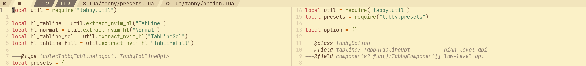
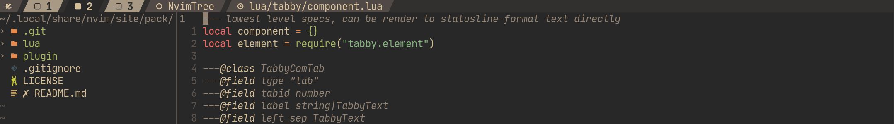
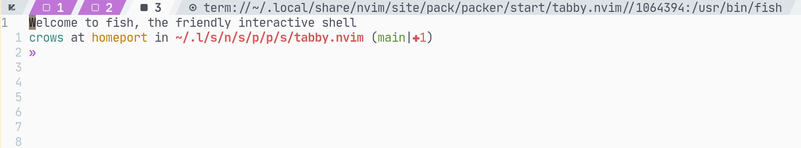
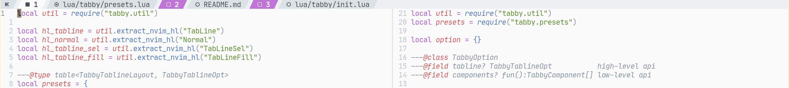
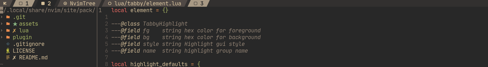

# tabby.nvim

A minimal, configurable, neovim style tabline. Use your nvim tabs as workspace multiplexer!





### status

Need to improve documents.

## Quick start

Use your plugin manager to installing:

```
"kyazdani42/nvim-web-devicons",
"nanozuki/tabby.nvim",
```

The `nvim-web-devicons` provide the icon support, you may like to use a nerdfonts-patched font.
If your config dont use icons, you have no need to install that.

And setup tabby in your config file:

```lua
require"tabby".setup()
```

If you use packer:

```lua
use {
    "nanozuki/tabby.nvim",
    requires = "kyazdani42/nvim-web-devicons",
    config = function() require("tabby").setup() end,
}
```

## Use presets

Builtin presets only use the highlight group `Tabline`, `TablineSel`, `TablineFill` and `Normal`,
in case to support most colorschemes.
there are three [presets](https://github.com/nanozuki/tabby.nvim/blob/main/lua/tabby/presets.lua) for now:

* active_wins_at_end [default]

Put all windows' labels in active tabpage after all tags label. In-active tabpage's window won't display.


* tab_with_top_win

Each tab lab with a top window label followed. The `top window` is the focus window when you enter a tabpage.



* active_tab_with_wins

Active tabpage's windows' labels is displayed after the active tabpage's label.




```lua
require("tabby").setup({
    tabline = require("tabby.presets").tab_with_top_win,
})
```


```
active_tab_with_wins
active_wins_at_end
tab_with_top_win
```

## Customize with high level apis

use `tabby.tabline.*` to write your own option.tabline.

https://github.com/nanozuki/tabby.nvim/blob/main/lua/tabby/tabline.lua

## Customize with low level apis

use `tabby.component.*` to write your own option.components

https://github.com/nanozuki/tabby.nvim/blob/main/lua/tabby/component.lua
